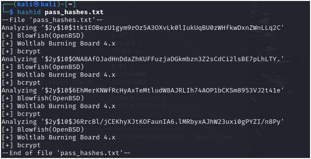
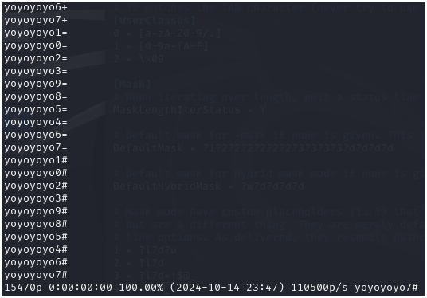

# Speed Running John the Ripper (JtR) in Kali Linux

This guide is a quick and casual way to leverage the functionality of John the Ripper (JtR) based on practical experience.

## Helpful Resources
- [John The Ripper Cheat Sheet](https://countuponsecurity.com/wp-content/uploads/2016/09/jtr-cheat-sheet.pdf)
- [Masking Rules in JtR](https://miloserdov.org/?p=5031)

---

## Running JtR with the Help Command
To get a list of available options and commands:
```bash
john --help
```

---

## Brute Force Password Cracking
To run a brute force attack using a wordlist:
```bash
john --format=<hash-type> --wordlist=<local-wordlist-file> <target-hash>
```
For example:
```bash
john --format=bcrypt --wordlist=wordlist.txt hash.txt
```
Learn more about supported hash formats [here](https://pentestmonkey.net/cheat-sheet/john-the-ripper-hash-formats).

---

## Identifying Hash Types with Hashid
Hashid is a useful tool for identifying hash types. To use it:
```bash
hashid <target-hash-file>
```
Example result:


---

## Creating Custom Rules in JtR
1. Navigate to the configuration directory:
   ```bash
   cd /etc/john
   ```
2. Open the `john.conf` file with a text editor.
3. Add your custom rule using the following format:
   ```
   [List.Rules:<name-of-the-rule>]
   <rule>
   ```

### Use Case: Append 1 to 3 Additional Symbols to Words
Custom rule example:
```plaintext
[List.Rules:AppendSymbols]
Az"[\+,\-,\*,\&,\@]"
Az"[\+,\-,\*,\&,\@]"Az"[\+,\-,\*,\&,\@]"
Az"[\+,\-,\*,\&,\@]"Az"[\+,\-,\*,\&,\@]"Az"[\+,\-,\*,\&,\@]"
```
#### Explanation:
- **First rule:** Appends one symbol (e.g., `hello+`, `hello-`, etc.).
- **Second rule:** Appends two symbols (e.g., `hello++`, `hello+-`, etc.).
- **Third rule:** Appends three symbols (e.g., `hello+++`, `hello++-`, etc.).

See the result generated by JtR in `ThreeCombiSymbols-Result.txt`.
- Note that the original wordlist is not included in the new wordlist, so it must be manually added to the new wordlist (unless another method is found).

**Note:** Some symbols require escaping (e.g., `\+`).

4. Use your custom rule:
   ```bash
   john --wordlist=<wordlist-file> --stdout --rules:AppendSymbols > new_wordlist.txt
   ```
For more on syntax and rules, see the resources at the top of this file.

---

## Simple Mask Mode in JtR
### Use Case: Duplicate Words, Append Digits and Symbols
Command example:
```bash
john --wordlist=wordlist.txt --mask='?w?w?d?1' --1="[\~,\!,\-,\+,\=,\#]" --stdout
```
#### Result Snippet:

#### Explanation:
- `?w?w`: Duplicates the word twice.
- `?d`: Appends a digit (0-9).
- `?1`: Placeholder for a custom symbol list defined by `--1="[\~,\!,\-,\+,\=,\#]"`.
- `--stdout`: Prints the output to verify the applied rule.

For more on mask symbols, check the masking section in the linked resources above.
